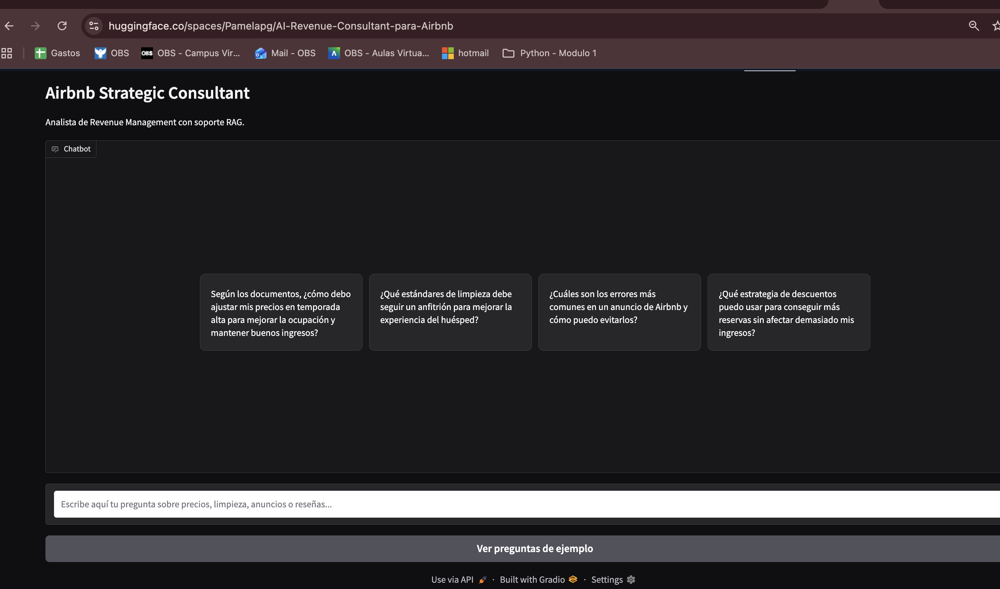
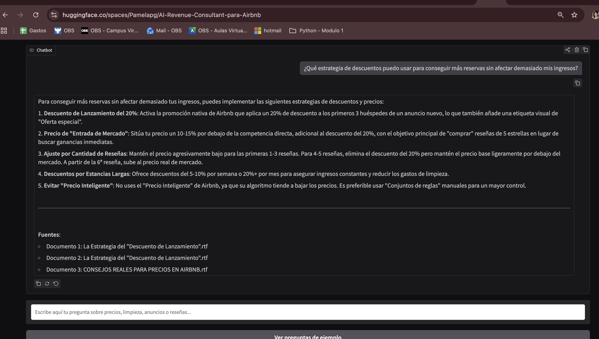
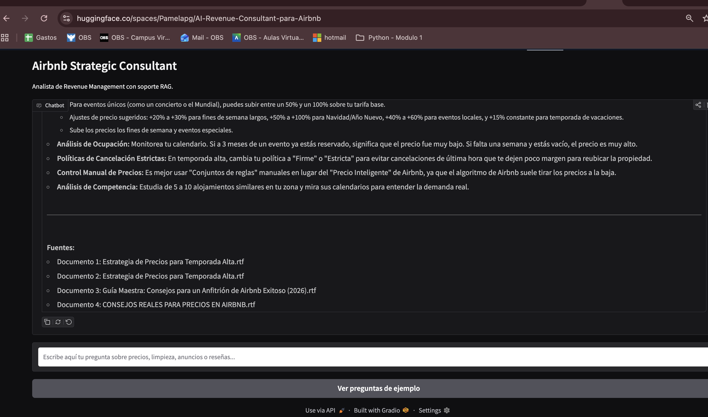

# AI Revenue Consultant para Airbnb

## Descripción del proyecto

AI Revenue Consultant para Airbnb es una aplicación web con inteligencia artificial que permite consultar documentos sobre estrategias de precios, limpieza, mantenimiento, descuentos y optimización de anuncios para alojamientos en Airbnb.

El proyecto utiliza un sistema RAG para recuperar información relevante desde documentos `.rtf` y generar respuestas fundamentadas con Gemini. La app ayuda a anfitriones a tomar mejores decisiones sobre revenue management, mejorar sus anuncios y mantener estándares operativos más claros.

Cada respuesta incluye una sección de fuentes, donde se muestran los documentos utilizados para generar la respuesta.


## Tecnologías utilizadas

- Python
- Gradio
- LangChain
- Gemini API
- Gemini 2.0 Flash / Gemini 2.5 Flash
- GoogleGenerativeAIEmbeddings
- ChromaDB
- striprtf
- Hugging Face Spaces
- GitHub

## Funcionalidades principales

- Interfaz web de chat creada con Gradio.
- Sistema RAG usando LangChain.
- Modelo Gemini integrado mediante API de Google.
- Lectura de documentos `.rtf`.
- División de documentos en fragmentos con `RecursiveCharacterTextSplitter`.
- Base vectorial en memoria usando ChromaDB.
- Recuperación de documentos relevantes por similitud.
- Respuestas con fuentes obligatorias.
- Preguntas de ejemplo para facilitar el uso de la app.

## App desplegada

La aplicación está disponible en Hugging Face Spaces:

[https://huggingface.co/spaces/Pamelapg/AI-Revenue-Consultant-para-Airbnb](https://huggingface.co/spaces/Pamelapg/AI-Revenue-Consultant-para-Airbnb)

## Repositorio

Código fuente disponible en GitHub:

[https://github.com/pamepg23/AI-Revenue-Consultant-para-Airbnb](https://github.com/pamepg23/AI-Revenue-Consultant-para-Airbnb)

## Instalación y ejecución local

### 1. Clonar el repositorio

```bash
git clone https://github.com/pamepg23/AI-Revenue-Consultant-para-Airbnb.git
cd AI-Revenue-Consultant-para-Airbnb
```

### 2.  Instalar dependencias

pip install -r requirements.txt


3. Configurar API Key de Google
Debes crear una API key en Google AI Studio y configurarla como variable de entorno.

En macOS o Linux:
export GOOGLE_API_KEY="TU_API_KEY"

En Windows PowerShell:
$env:GOOGLE_API_KEY="TU_API_KEY"

4. Ejecutar la app
python app.py

Luego abre el link local que aparece en la terminal, normalmente:
http://127.0.0.1:7860

Estructura del proyecto

AI-Revenue-Consultant-para-Airbnb/
├── app.py
├── requirements.txt
├── README.md
├── documents/
│   ├── CONSEJOS REALES PARA PRECIOS EN AIRBNB.rtf
│   ├── Errores en el Anuncio.rtf
│   ├── Estrategia de Precios para Temporada Alta.rtf
│   └── ...
└── rag_gemini_airbnb.ipynb

Capturas de pantalla





Ejemplos de preguntas
¿Qué estrategia de descuentos puedo usar para conseguir más reservas sin afectar demasiado mis ingresos?
¿Qué estándares de limpieza debe seguir un anfitrión para mejorar la experiencia del huésped?
Según los documentos, ¿cómo debo ajustar mis precios en temporada alta para mejorar la ocupación y mantener buenos ingresos?

Nota sobre límites de API
La app utiliza la API de Gemini. Si se alcanza la cuota gratuita disponible, puede aparecer temporalmente un error de límite de uso. En ese caso, se debe esperar a que la cuota se restablezca o usar una API key con mayor disponibilidad.

Autora
Proyecto desarrollado por Pamela Paniagua Gomez
